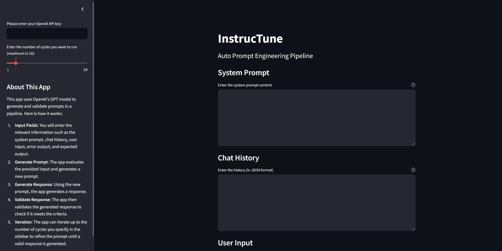

# InstrucTune
InstrucTune is a prompt enginnering application aimed at automating the refinement of prompts using OpenAI's GPT model. It iteratively tunes instructions to generate valid responses, making it a powerful tool for prompt engineering. 

Given a system prompt and additional context from previous chat interactions, the app iteratively refines the prompt to produce a valid response up to a specified number of cycles or until it reaches the desired LLM output.

## Features

1. **Inputs**: Users can input the system prompt, chat history, user input, error output, and expected output.
2. **Generate Prompt**: The app evaluates the provided input and generates a new prompt.
3. **Generate Response**: Using the new prompt, the app generates a response.
4. **Validate Response**: The app validates the generated response to check if it meets the criteria.
5. **Iteration**: The app iterates up to the number of cycles specified to refine the prompt until a valid response is generated.

## How to Run the Application

### Prerequisites

- Python 3.8+
- OpenAI API key

### Installation

1. Clone the repository:

   ```bash
   git clone https://github.com/akshitjha23/instructune.git
   cd instructune
   ```

2. Create and activate a virtual environment:

   ```bash
   python3 -m venv venv
   source venv/bin/activate  # On Windows use `venv\Scripts\activate`
   ```

3. Install the dependencies:

   ```bash
   pip install -r requirements.txt
   ```

### Running the streamlit application

Run the Streamlit app:

   ```bash
   streamlit run app.py
   ```

### Usage

1. Enter your OpenAI API key in the sidebar.
2. Fill in the required fields:
   - System Prompt
   - Chat History (in JSON format)
   - User Input
   - Error Output (in JSON format)
   - Expected Output (in JSON format)
3. Specify the number of cycles you want the application to iterate through.
4. Click the "Run Pipeline" button.

### Directory Structure

```bash
.
├── .gitignore
├── app.py
├── LICENSE
├── README.md
├── requirements.txt
└── runtime.log
```
## License <a name = "license"></a>

This project is licensed under the MIT License - see
the [LICENSE](https://github.com/akshitjha23/instructune/blob/main/LICENSE) file for
details.
